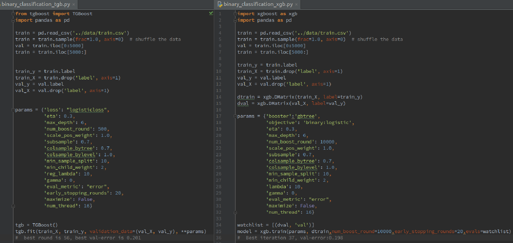

##What is TGBoost
It is a **T**iny implement of **G**radient **Boost**ing tree, based on the xgboost algorithm, and support most features in [xgboost](https://github.com/dmlc/xgboost). This project aims to help people get deeper insights into GBM, especially XGBoost. The current implement has little optimization, so the code is easy to follow. But this leads to high memory consumption and slow speed. 

Briefly, TGBoost supports:

- **Built-in loss**, Square error loss for regression task, Logistic loss for classification task

- **Customized loss**, use `autograd` to calculate the grad and hess automaticly

- **Early stopping**, evaluate on validation set and conduct early stopping.

- **Multi-processing**, when finding best tree node split
	
- **Feature importance**, output the feature importance after training
	
- **Handle missing value**, the tree can learn a direction for those with NAN feature value 

- **Regularization**, lambda, gamma (as in xgboost scoring function)

- **Randomness**, subsample，colsample_bytree，colsample_bylevel
- **Weighted loss function**, assign weight to each sample.

##Dependence
TGBoost is implemented in `Python 2.7`, use `Pandas.DataFrame` to store data, and `autograd` to take derivation. These package can be easily installed using `pip`.

- Pandas
- Numpy
- autograd


## Compared with XGBoost

It is a binary classification task, the dataset can be downloaded from [here](http://pan.baidu.com/s/1c23gJkc). It has 40000 samples and each sample with 52 features, some feature has missing value. The dataset is splited into trainset and validation set, and compare the performance of TGBoost and XGBoost on the validation set.

As the following figure shows, TGBoost get its best result at iteration 56 with **0.201 error rate**. XGBoost gets  its best result at iteration 37 with **0.198 error rate**. They are roughly the same!  However, I must say TGBoost is relatively slow.




##More Example

You can define your own loss function:

```python

from tgboost import TGBoost
import pandas as pd
import autograd.numpy as anp

train = pd.read_csv('../data/train.csv')
train = train.sample(frac=1.0, axis=0)  # shuffle the data
val = train.iloc[0:5000]
train = train.iloc[5000:]

train_y = train.label
train_X = train.drop('label', axis=1)
val_y = val.label
val_X = val.drop('label', axis=1)


def logistic_loss(pred, y):
    return -(y*anp.log(pred) + (1-y)*anp.log(1-pred))

params = {'loss': logistic_loss,
          'eta': 0.3,
          'max_depth': 6,
          'num_boost_round': 500,
          'scale_pos_weight': 1.0,
          'subsample': 0.7,
          'colsample_bytree': 0.7,
          'colsample_bylevel': 1.0,
          'min_sample_split': 10,
          'min_child_weight': 2,
          'reg_lambda': 10,
          'gamma': 0,
          'eval_metric': "error",
          'early_stopping_rounds': 20,
          'maximize': False,
          'num_thread': 16}

tgb = TGBoost()
tgb.fit(train_X, train_y, validation_data=(val_X, val_y), **params)

```

## TODO
- reduce memory usage
- speed up training and predicting

- post prunning

	the current implement just stop growing the tree when the split gain is negative, better to use post prunning instead(as in xgboost)

- metric: 
	
	auc, mse, mae, precision, recall, f_score, etc.

- cross validation

- implement a high-performance data structure to replace `Pandas.DataFrame`
##Reference

- [XGBoost: A Scalable Tree Boosting System](https://arxiv.org/abs/1603.02754)
- [Higgs Boson Discovery with Boosted Trees](http://www.jmlr.org/proceedings/papers/v42/chen14.pdf)
